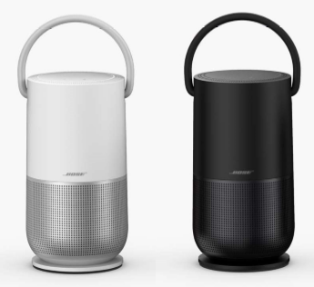

Taylor
======
<a title='Latest release in GitHub' target='_blank' href='https://github.com/BoseCorp/Taylor'></a>
[Taylor Continuous build Testing] <a title='Jenkins build status for Taylor' href='http://jnkwebhook.ngrok.io/job/Continous_Build_Testing/job/Taylor_Continuous_Build_Testing/'></a> [Taylor Nightly build testing] <a title='Jenkins build status for Taylor' href='http://jnkwebhook.ngrok.io/job/Pipelines/job/Castle-Pipeline/'></a>

<!-- ngrok is used for secure tunnel so our jenkins server behind our firewall can be accessed from GitHub. When the tests are added and a pull request is submitted an automatic jenkins build is initiated. When that build is successful or failed it will automatically get updated in the Readme. We are using a jenkins plugin that uses API's to update the status of the jenkins build.-->

This repo contains the source code and tools specific to the Taylor product.



##### Table of Contents
[Software Updates](#updates)   
[Getting Started](#start)   
[External References](#links)   
[Building different LPM BLOBs](#lpmblobs)   
[PTS Server Links](#pts)   
[More...](#more)  

<a name="updates"/>

### Software Updates

Different ways to perform Software Update are:

#### Bonjour update

To update the software (SoundTouch, HSP, LPM, etc) as a user, it is highly recommended to use Bonjour.
Follow the instructions found on the wiki: [Bonjour Update of Taylor](https://wiki.bose.com/display/WSSW/Bonjour+Update+of+Taylor).

For a simpler-way; see ./pushup script.

To update the software, along with HSP, use product_update.zip file. To update
the software, without HSP update (recommended only if HSP version you are
updating to, is same as one on device), use product_update_no_hsp.zip.

#### QFIL / VIP

If you suspect your system is not in correct state that Bonjour update can
work or it no longer boots, please use QFIL / VIP programming. Follow the
instructions found on the wiki: [Recoverying A Bricked
Taylor](https://wiki.bose.com/display/WSSW/Recovering+A+Bricked+Taylor).

#### push-to-target Script

In case if you do not want to perform full software update and just copy
binaries/libraries related to your module you can use push-to-target script
under scripts directory.  Example usage:

1. Let say you want to push Software update module binaries to your device [same way you can use -l for libraries and -c for config files]

```shell session
    push-to-target -b SoftwareUpdateService [-i ADB_device_id] [-r reset_device]
```

2. Let say you want to push Software Update components(libraries, binaries and configuration files) to your device

```shell session
    push-to-target -m SoftwareUpdate [-i ADB_device_id] [-r reset_device]
```

3. Let say you want to push Software Update as well as NetManager components to your device

```shell session
    push-to-target -m SoftwareUpdate NetManager [-i ADB_device_id] [-r reset_device]
```

4. You can copy all the binaries built in you local system using

```shell session
    push-to-target -a [-i ADB_device_id] [-r reset_device]
```

Please note that this script will stop all services in your device so you will
need to restart all services after copy or you can just use -r option to reset
device after push operation.

<a name="start"/>

### Getting Started

Checkout CastleTools.git and Taylor.git:
```shell session
$ cd /scratch
$ git clone git@github.com:BoseCorp/CastleTools.git
$ PATH=$PATH:/scratch/CastleTools/bin   # add this to your ~/.profile, ~/.bash_profile or ~/.login
$ git clone git@github.com:BoseCorp/Taylor.git
```

Make sure your Taylor unit is accessible via adb.
```shell session
$ sudo adb start-server             # must be done as root. typically once per boot of the build host
$ adb devices
List of devices attached
5166240	device

$
```

To perform Bonjour-Update; use the pushup script:

From the Taylor workspace:

```shell session
$ cd /scratch/Taylor
$ pip2.7 install -r Test/requirements.txt
$ make all-packages
```

```shell session
To update without HSP:
$ ./scripts/pushup

To update HSP:
$ ./scripts/pushup --hsp

When having multiple devices, without HSP:
$ ./scripts/pushup --deviceid <deviceid>

When having multiple devices, with HSP:
$ ./scripts/pushup --deviceid <deviceid> --hsp
```

In general:

```shell session
$ cd /scratch
$ git clone git@github.com:BoseCorp/CastleTestUtils.git
$ cd CastleTestUtils
$ pip2.7 install -r requirements.txt
$ ./CastleTestUtils/scripts/pushup --deviceid <device-id> --zipfile <path-to-zipfile>
```

<a name="links"/>

### External References

Taylor [Getting Started](https://wiki.bose.com/display/WSSW/Taylor+Quick+Start+Guide)

[Updating Individual Components on Taylor](https://wiki.bose.com/display/WSSW/Updating+Individual+Components+on+Taylor)

<a name="lpmblobs"/>

### Building different LPM BLOBs

By default the BLOB that is used to create the lpm_updater.ipk will be a
Release BLOB based off of the release manifest xml located in the
LpmManifestFiles directory. If you wish to create a BLOB based on Continuous
or Nightly builds of components try building with the commands below:

```shell session
# Install components and run make normally
$ make
# After running make you can now create different types of LPM BLOBs

# Create a BLOB using the LpmManifestFiles/continuous_lpm_package.xml
$ make lpmupdater-ipk BUILD_TYPE=Continuous

# Create a BLOB using the LpmManifestFiles/nightly_lpm_package.xml
$ make lpmupdater-ipk BUILD_TYPE=Nightly

# Create a BLOB using the LpmManifestFiles/release_lpm_package.xml
# Note: By default the build process will use this method.
$ make lpmupdater-ipk BUILD_TYPE=Release
```

<a name="pts"/>

### PTS Server Links

The PTS Server is a tiny embedded web server.  The server was originally
intended for information to investigate customer problems reported to the
technical support team.  The server has evolved to have a broader purpose.

For security reasons, some endpoints are accessible only via certain
interfaces.  For testing, you can disable this
restriction: `touch /mnt/nv/product-persistence/anyiface`.

| Interface | Endpoint | Description |
| -------- | -------- | ----------- |
| usb | /diag | Quality Audit |
| usb+ | /logread.txt | A snapshot of the system log ring buffer |
| usb+ | /logread.txt.gz | Same as /logread.txt but compressed |
| usb+ | /pts.txt | Various Linux and system status information (e.g., ifconfig) |
| usb | /reflash | Force the unit into reflash mode (QFIL) |
| usb | /bose-version | /opt/Bose/etc/BoseVersion.json |
| usb | /kernel-version | /etc/riviera-version |
| usb | /validate-mfgdata | Check the manufacturing data |
| usb | /controller-version | The LPM version strings |
| usb | /clear-first-greeting | Clear the flag indicating the unit's first boot |
| any | /opensource | List the licenses of open source software used in the system |
| any | /service | Remanufacturing. Only if the unit is in service mode |
| any | /dev | Developer links. Only if the unit is in development mode |
| usb, wlan1 | /, /index.html | Wi-Fi setup |

\+ Not enforced until SOS.

The USB IP address is 203.0.113.1.
For example: http://203.0.113.1/pts.txt

<a name="more"/>

### More...

Ask to be added to the SSG-Taylor mailing list to stay in the loop by clicking
[here](mailto:Jonathan_Cooper@bose.com?subject=Add%20me%20to%20the%20SSG-Taylor).

[Join the Taylor Slack channel.](https://bosessg.slack.com/messages/CBMJH0U01)

Access the APQ console via the tap cable.

```shell session
$ cat /etc/minirc.usb0
pr port             /dev/ttyUSB0
pu baudrate         115200
pu bits             8
pu parity           N
pu stopbits         1
pu minit
pu mreset
pu mhangup
pu rtscts           No
pu logfname         /dev/null
$ minicom -w -C minicom.cap usb0
```

Use `dmesg` to see if your tap cable is actually USB0.

If you use `adb shell` to login, you won't have the usual environment by default.
To setup the usual environment:

```shell session
$ adb shell
Sat Sep  2 12:10:12 UTC 2017
Device name: "Bose SoundTouch C7E3A2"
mc1014468@hepdsw64.bose.com 2017-08-31T08:40:21 master 0.0.1-1+3e07c68
#
# type start
start is /opt/Bose/bin/start
#
```

Certain important error and status messages go only to the console.
You generally won't see this information via `adb shell`.

To enable development mode:

```shell session
# mount -oremount,rw /persist
# mfgdata set development true
# mount -oremount,ro /persist
```

This flag enables core dumps, telnet access and other debug features.
In particular, if a daemon dies unexpectedly, no automatic recovery
happens when development mode is enabled.
