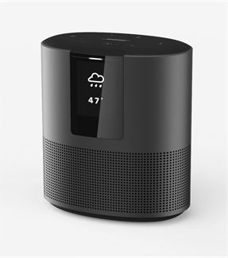

#### Eddie Jenkins Smoke Test Status
<a title='Jenkins build status for Eddie' href='http://jnkwebhook.ngrok.io/job/Pipelines/job/Eddie-Pipeline/'></a>

<!-- ngrok is used for secure tunnel so our jenkins server behind our firewall can be accessed from GitHub. When the tests are added and a pull request is submitted an automatic jenkins build is initiated. When that build is successful or failed it will automatically get updated in the Readme. We are using a jenkins plugin that uses API's to update the status of the jenkins build.-->

SoundTouch Eddie
================

This repo contains the source code and tools specific to the SoundTouch Eddie product.



##### Table of Contents
[Software Updates](#updates)
[Getting Started](#start)
[External References](#links)
[More...](#more)  

<a name="updates"/>

### Software Updates

To update the software (SoundTouch, HSP, LPM, etc) as a user, it is highly recommended to use Bonjour. Follow the instructions found on the wiki: [Bonjour Update of Eddie](https://wiki.bose.com/display/WSSW/Bonjour+Update+of+Eddie). 

Do this whenever you need to update the HSP. Thereafter you may use opkg and etc. to install newer versions of SoundTouch as described later in this document.

<a name="start"/>

### Getting Started

Checkout CastleTools.git and Eddie.git:
```shell session
$ cd /scratch
$ git clone git@github.com:BoseCorp/CastleTools.git
$ PATH=$PATH:/scratch/CastleTools/bin   # add this to your ~/.profile, ~/.bash_profile or ~/.login
$ git clone git@github.com:BoseCorp/Eddie.git
```

Build the .ipk package file containing the SoundTouch software.
```shell session
$ cd /scratch/Eddie
$ make package
```

Make sure your Eddie unit is accessible via adb.
```shell session
$ sudo adb start-server             # must be done as root. typically once per boot of the build host
$ adb devices
List of devices attached
5166240	device

$
```

Install the .ipk file you built.
```shell session
$ adb shell /opt/Bose/bin/stop      # generally it's okay if this fails
$ adb shell /opt/Bose/bin/rw        # make the file systems writeable
$ adb shell opkg remove SoundTouch  # this too may fail
$ adb push builds/Release/product.ipk /tmp/product.ipk
$ adb shell opkg install -d bose /tmp/product.ipk
$ adb shell reboot
```
(But see `putipk` below for a simpler way.)

You'll get a notification if your Riviera unit is running old Riviera software:
```shell session
...
Built for Riviera-HSP: 0.5-9-geee2c72
Installed Riviera-HSP: 0.5-7-g856bf73
...
```

<a name="links"/>

### External References

Eddie [Getting Started](https://wiki.bose.com/display/WSSW/Eddie+Quick+Start+Guide)

[Updating Individual Components on Eddie](https://wiki.bose.com/display/WSSW/Updating+Individual+Components+on+Eddie)

### More...

Ask to be added to the SSG-Eddie mailing list to stay in the loop by clicking
[here](mailto:Jonathan_Cooper@bose.com?subject=Add%20me%20to%20the%20SSG-Eddie%20mailing%20list).

To rebuild the .ipk file and install via adb in one step:

```shell session
$ ./scripts/putipk
```

Access the APQ console via the tap cable.

```shell session
$ cat /etc/minirc.usb0
pr port             /dev/ttyUSB0
pu baudrate         115200
pu bits             8
pu parity           N
pu stopbits         1
pu minit
pu mreset
pu mhangup
pu rtscts           No
pu logfname         /dev/null
$ minicom -w -C minicom.cap usb0
```

Use `dmesg` to see if your tap cable is actually USB0.

If you use `adb shell` to login, you won't have the usual environment by default.
To setup the usual environment:

```shell session
$ adb shell
/ # . ~/.profile
Sat Sep  2 12:10:12 UTC 2017
Device name: "Bose SoundTouch C7E3A2"
mc1014468@hepdsw64.bose.com 2017-08-31T08:40:21 master 0.0.1-1+3e07c68
#
# type start
start is /opt/Bose/bin/start
#
```

Certain important error and status messages go only to the console.
You generally won't see this information via `adb shell`.

To enable development mode:

```shell session
# mount -oremount,rw /persist
# mfgdata set development true
# mount -oremount,ro /persist
```

This flag enables core dumps, telnet access and other debug features.
In particular, if a daemon dies unexpectedly, no automatic recovery
happens when development mode is enabled.
