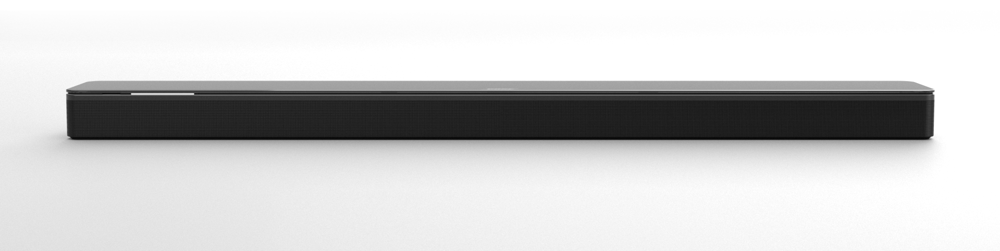
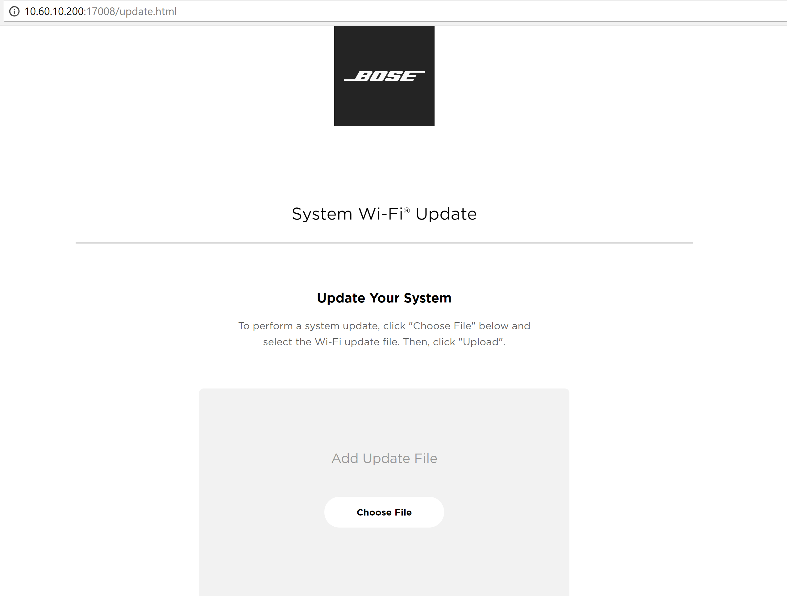
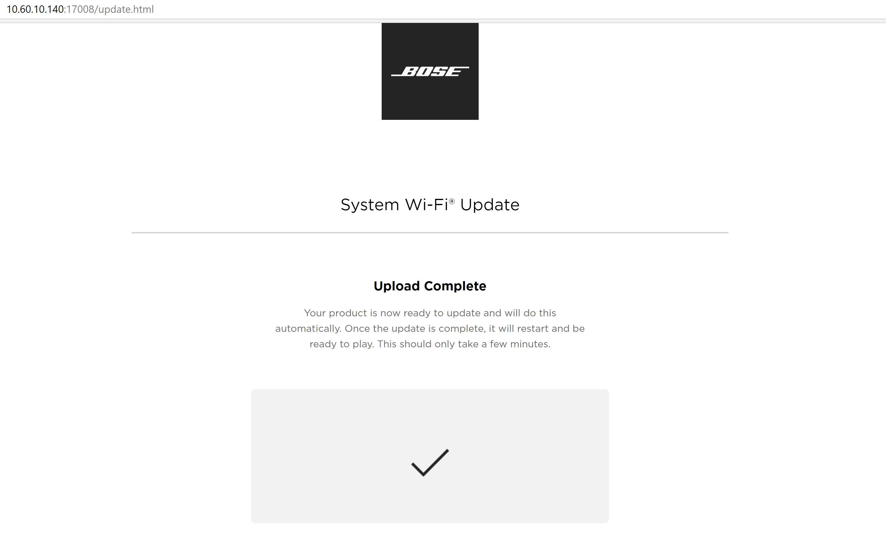

SoundTouch Professor
====================

This repo contains the source code and tools specific to the SoundTouch Professor product.

For updates about new releases of this software, you can subscribe [here](https://platform.bose.io/dev/svc-embedded-releases/stable-test/web-server/). 

For more information, see the [Professor wiki page](https://wiki.bose.com/display/A4V/Professor).



##### Table of Contents  
[Getting Started](#start)  
[Compiling Professor](#compile)  
[Installing Professor](#install)  
[Reflash Riviera-HSP](#hsp)  
[Update LPM via APQ using IPK](#lpm)   
[More...](#more)  

<a name="start"/>

### Getting Started

Checkout CastleTools.git and Professor.git:
```shell session
$ cd /scratch
$ git clone git@github.com:BoseCorp/CastleTools.git
$ PATH=$PATH:/scratch/CastleTools/bin   # add this to your ~/.profile, ~/.bash_profile or ~/.login
$ git clone git@github.com:BoseCorp/Professor.git
```

<a name="compile">

### Compiling Professor

How you compile the software will depend largely on how you plan to flash it to the device. Several options are listed below.
In all cases, you will need to precede the 'make' command with `env RIVIERA_HSP_VERSION=[Version-Number]`. For DP1, the version you need is `1.3`, but for DP2 or later you will be able to use the latest version.

#### 'make package' for Product Flash Script

Build the Professor package to install using the product_flash script.
```shell session
$ cd /scratch/Professor
$ env RIVIERA_HSP_VERSION=1.3 make package
```


#### 'make update-zip' for Bonjour Update

Build the Professor product_update.zip to install over ethernet.
```shell session
$ cd /scratch/Professor
$ env RIVIERA_HSP_VERSION=1.3 make packages-gz update-zip
```

You can also build an update zip file that includes the Riviera HSP.
```shell session
$ cd /scratch/Professor
$ env RIVIERA_HSP_VERSION=1.3 make packages-gz-with-hsp update-zip-with-hsp
```


#### 'make' ipk for OPKG installation 

Build the Professor product.ipk to install using the putipk_ota script.
```shell session
$ cd /scratch/Professor
$ env RIVIERA_HSP_VERSION=1.3 make
```

<a name="compile">

### Installing Professor

There are a number of different ways in which you can flash the software to your device, several of which are listed below. 
Regardless of the method you used, you can verify that your update was successful by running the following command to check the version:

```shell session
adb shell LD_LIBRARY_PATH=/opt/Bose/update/opkg /opt/Bose/update/opkg/opkg -f /mnt/nv/update/opkg.conf --volatile-cache  --add-arch armv7a-vfp-neon:100  list
```


#### Product Flash Script

Make sure your Professor unit is accessible via adb.
```shell session
$ sudo adb start-server             # must be done as root. typically once per boot of the build host
$ adb devices
List of devices attached
5166240	device

$
```

Use the product_flash script to install the package you compiled above.
```shell session
$ cd builds/Release/package
$ sudo ./product_flash product.tar fastboot [option(s)]
```

There are several options available in the product_flash script, depending on what you wish to update:
```shell
	-h 		# Show the help message for this script
	-u 		# Flash only the Bose Partition
	-a 		# Flash all partitions (except usrfs, persist, bose-persist and partition table)
	-f 		# Erase All partitions, including Partition table, and install all IPKs
	-e 		# Erase only bose-persist partition
	-l 		# Perform LPM update using IPK
```


#### Bonjour

Power on the device and attach an ethernet cable. Once the device is booted, use adb to query the ip address of the eth0 network interface:
```shell session
$ ifconfig
eth0      Link encap:Ethernet  HWaddr 04:B0:5E:56:76:FC  
          inet addr:10.60.5.51  Bcast:10.60.46.255  Mask:255.255.255.0
          UP BROADCAST RUNNING MULTICAST  MTU:1500  Metric:1
          RX packets:8922 errors:0 dropped:155 overruns:0 frame:20241
          TX packets:40851 errors:0 dropped:0 overruns:0 carrier:0
          collisions:0 txqueuelen:1000 
          RX bytes:1617211 (1.5 MiB)  TX bytes:4253570 (4.0 MiB)
          Interrupt:137 

lo        Link encap:Local Loopback  
          inet addr:127.0.0.1  Mask:255.0.0.0
          inet6 addr: ::1/128 Scope:Host
          UP LOOPBACK RUNNING  MTU:65536  Metric:1
          RX packets:91517 errors:0 dropped:0 overruns:0 frame:0
          TX packets:91517 errors:0 dropped:0 overruns:0 carrier:0
          collisions:0 txqueuelen:0 
          RX bytes:31124620 (29.6 MiB)  TX bytes:31124620 (29.6 MiB)
```

Connect to your device through a web browser by going to http://<inet_addr>/update.html replacing <inet_addr> with the ip address of the eth0 interface listed in `ifconfig`

The following page should load:


Click the "Choose File" button and select an update zip file, which can be found in any Electric Commander build (e.g., \\\solid\softlib\verisoft\Professor\Release\master\0.3.1-640+916c122\HSP-1.3\product_update.zip) or built using the instructions above. 

After the transfer is completed, you should see a page that looks like the following:


Your device will reboot twice, and, after it has finished, your update should be complete. 


#### Putipk_ota Script

Make sure your Professor unit is accessible via adb.
```shell session
$ sudo adb start-server             # must be done as root. typically once per boot of the build host
$ adb devices
List of devices attached
5166240   device

$
```

Use the putipk_ota script to install the .ipk package you built.
```shell session
$ sudo ./scripts/putipk_ota builds/Release/product.ipk
```

Alternatively, you can use the putipk_ota script without specifying a file, and it will rebuild the .ipk for you.
```shell session
$ sudo ./scripts/putipk_ota
```

<a name="hsp"/>

### Reflashing the Riviera HSP

To reflash the Riviera HSP from Linux:
```shell session
$ cd /scratch/Professor
$ components install
$ adb shell reboot bootloader       # reboot the Riviera unit into the fastboot bootloader
$ sudo fastboot devices             # make sure the unit is in the bootloader
$ cd `components get Riviera-HSP-Images installed_location`
$ sudo ./fastboot.sh
$ sudo fastboot reboot
```

To reflash the Riviera HSP from Windows Command Prompt:
```shell session
$ adb reboot bootloader             # reboot the Riviera unit into the fastboot bootloader
$ fastboot devices                  # check that the fastboot device is present
$ fastboot.sh                       # run the fastboot script

*** See the Fastboot section of https://wiki.bose.com/display/BC/1.+Flashing+the+SNAP+Board for Fastboot
    installation instructions.
```

<a name="lpm"/>

### Updating LPM from APQ using IPK

To update LPM from APQ:
```shell session
$ cd /scratch/Professor
$ ./scripts/putlpm  # Install LPM ipk from the latest Continuous master build
$ ./scripts/putlpm ./builds/Release/lpm_updater.ipk # Install LPM ipk generated by make package
$ ./scripts/putlpm <path-to-lpm-ipk> # Install a specific LPM ipk  
```

### More...

Access the APQ console via the tap cable.

```shell session
$ cat /etc/minirc.usb0
pr port             /dev/ttyUSB0
pu baudrate         115200
pu bits             8
pu parity           N
pu stopbits         1
pu minit
pu mreset
pu mhangup
pu rtscts           No
pu logfname         /dev/null
$ minicom -w -C minicom.cap usb0
```

Use `dmesg` to see if your tap cable is actually USB0.

If you use `adb shell` to login, you won't have the usual environment by default.
To setup the usual environment:

```shell session
$ adb shell
/ # . ~/.profile
Sat Sep  2 12:10:12 UTC 2017
Device name: "Bose SoundTouch C7E3A2"
mc1014468@hepdsw64.bose.com 2017-08-31T08:40:21 master 0.0.1-1+3e07c68
#
# type start
start is /opt/Bose/bin/start
#
```

Certain important error and status messages go only to the console.
You generally won't see this information via `adb shell`.
